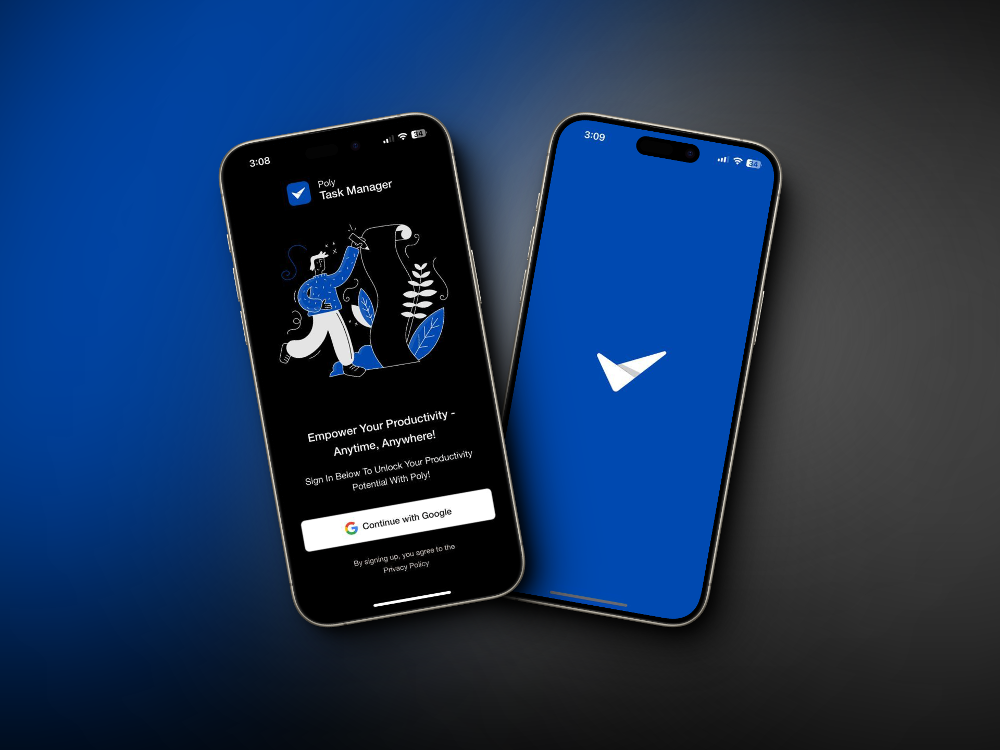

# Poly Task Management


Poly Task Management is a cross-platform task management application built for both Android and iOS. It's designed to help users manage their tasks efficiently and effectively.



## Tech Stack

The application is built using the following technologies:

- **React Native**: A popular framework for building mobile applications using JavaScript and React.
- **Expo**: A set of tools built around React Native to help you quickly start an app.
- **TypeScript**: A typed superset of JavaScript that adds static types.
- **MobX State Tree**: A state management library that simplifies the handling of complex data structures.
- **Reactotron**: A desktop app for inspecting your React JS and React Native projects.
- **Supabase**: An open source Firebase alternative. It provides a backend as a service with a real-time database, authentication, and more.
- **Ignite**: A boilerplate generator for React Native that lets you choose from various project templates to save you from time-consuming setup and configuration.

## Folder Structure

The project has a standard React Native project structure with some additional directories:

- `android/` and `ios/`: These directories contain all the code needed to run your app on Android and iOS respectively.
- `app/`: This directory contains all the JavaScript code for the app, including components, screens, and state management.
- `app/components/`: This directory contains all the reusable React components.
- `app/devtools/`: This directory contains configuration for Reactotron, a tool for inspecting your React and React Native applications.
- `assets/`: This directory contains all the static assets (images, fonts, etc.) used in the project.

## Important Files

- `app.json`: This file contains the configuration for the Expo tools, including the app's name, slug, and version, as well as platform-specific settings.
- `package.json`: This file lists the project's npm dependencies and defines the available script commands.
- `android/settings.gradle` and `android/app/build.gradle`: These files contain configuration for the Android build process.
- `ios/TodoMobile.xcworkspace/contents.xcworkspacedata` and `ios/TodoMobile.xcodeproj/project.pbxproj`: These files contain configuration for the iOS build process.
- `.env.example`: This file contains example environment variables needed for app to work. You need to copy this file to `.env` and replace the placeholders with your actual env variables.

## Running the Project

To run the project, you need to have Node.js, npm, and Expo CLI installed on your machine. Then, you can run the following commands:

```shell
# Install dependencies
yarn install

# Start the development server
yarn expo:start
```

- Before running the project, make sure to set up the environment variables in the `.env` file. You can find an example in the `.env.example` file.
- For setting up Google OAuth with Supabase, you can follow this [tutorial](https://blog.spirokit.com/google-authentication-with-expo-supabase).

This will start the Expo development server. You can then open the app on your device by scanning the QR code displayed in the terminal or on the Expo dev tools page.

## Contributing

Contributions are welcome! Please read the contributing guidelines before getting started.

<!-- ## License

This project is licensed under the terms of the MIT license. -->

This project is based on the Ignite template. A big shoutout to them for making the project setup process easier and more efficient.
